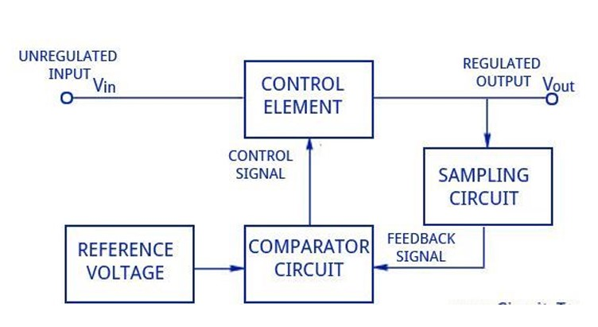

# Linear Power Supply

A robust 10V, 10A linear power supply built with discrete components.

---

## Features

- **Output:** 10V DC, up to 10A
- **Input:** 230V AC stepped down to 15V AC
- **Fully discrete design** (no programmable ICs)
- **Overcurrent protection**
- **Custom PCB & enclosure with active cooling**

---

## Block Diagram

---

## Quick Overview

- **Rectification:** Bridge rectifier converts AC to DC.
- **Smoothing:** Large capacitors minimize ripple.
- **Regulation:** Power transistors & feedback ensure stable output.
- **Protection:** MOSFETs and comparators guard against overcurrent.
- **Cooling:** Heat sinks and a DC fan manage thermal load.

---

## PCB Design

---
## SolidWorks Enclosure Design

---

## Team
 
- Dojitha Mirihagalla – Component selection and cct design, PCB Design, soldering, diagnosis.
- Pravindu Satharasinghe – Troubleshooting, testing, helping for soldering
- Charuka Bandara - Enclosure Design, Testing
- Selani Indrapala - Documentation, Testing

---

*Thank you for checking out our project!*
